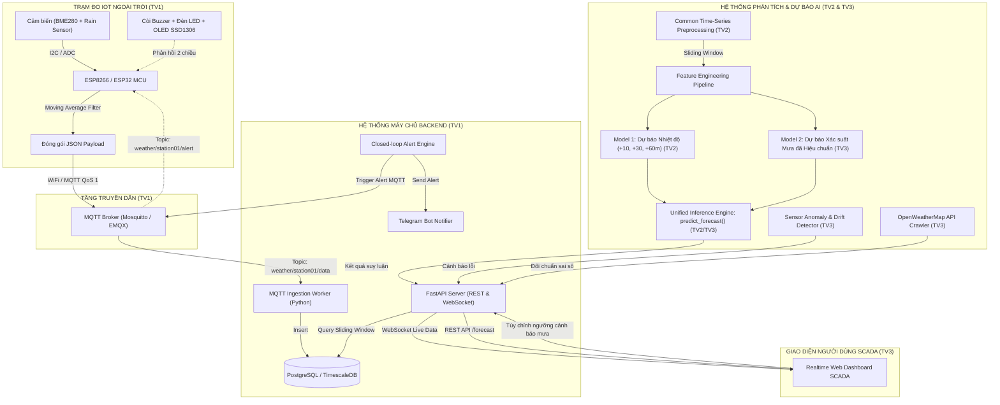

# IoT Local Weather Monitoring & Short-Term Forecasting System
### Hệ thống IoT Giám sát và Dự báo Thời tiết Cục bộ Ngắn hạn bằng Time Series Forecasting

[](LICENSE)
[](https://www.python.org/)
[](https://fastapi.tiangolo.com/)
[](https://www.postgresql.org/)
[](https://mqtt.org/)
[](https://www.espressif.com/)

---

## 1. Tổng quan Dự án (Project Overview)

Dự án phát triển một hệ thống IoT hoàn chỉnh khép kín từ tầng biên (Edge Sensing) đến máy chủ đám mây (Cloud Backend) và tầng ra quyết định (AI Forecasting & Actuation):
1. **Thu thập dữ liệu môi trường cục bộ:** Đo lường Nhiệt độ (°C), Độ ẩm (%), Áp suất khí quyển (hPa) qua cảm biến BME280 và lượng mưa qua Cảm biến mưa (Rain Sensor).
2. **Truyền dẫn tin cậy:** Sử dụng vi điều khiển ESP8266/ESP32 truyền dữ liệu JSON qua giao thức MQTT với cơ chế Auto-reconnect và đo đạc chất lượng dịch vụ (QoS).
3. **Lưu trữ chuỗi thời gian tối ưu:** Lưu trữ dữ liệu vào CSDL PostgreSQL / TimescaleDB với Composite Index phục vụ truy vấn cửa sổ trượt (Sliding Window).
4. **Dự báo thời tiết ngắn hạn (Time Series AI):**
   - **Mô hình 1 (Hồi quy đa bước):** Dự báo nhiệt độ tại các mốc $+10$, $+30$, $+60$ phút (XGBoost / Random Forest đối chuẩn với Deep Learning LSTM/GRU).
   - **Mô hình 2 (Phân loại & Hiệu chuẩn xác suất):** Dự báo khả năng mưa có hiệu chuẩn xác suất (Platt Scaling/Isotonic Regression) và phát hiện bất thường trôi cảm biến (Sensor Drift / Spike Anomaly).
5. **Giám sát SCADA & Điều khiển phản hồi khép kín (Closed-loop Actuation):**
   - Web Dashboard hiển thị thời gian thực qua WebSocket, so sánh đối chuẩn dữ liệu với OpenWeatherMap API.
   - Khi xác suất mưa vượt ngưỡng ($\ge 70\%$), Backend tự động bắn lệnh MQTT xuống trạm IoT kích hoạt Còi Buzzer/Đèn LED cảnh báo và gửi thông báo qua Telegram Bot.

---

## 2. Kiến trúc Hệ thống Tổng thể (System Architecture)



---

## 3. Cấu trúc Thư mục Dự án (Project Structure)

```text
IoT_Weather_Forecasting_Project/
├── .gitignore                          # Cấu hình bỏ qua tệp rác, file nhị phân nặng & secrets
├── CONTRIBUTING.md                     # Quy chuẩn Git flow, Commit, Code style, PR & Checklist
├── README.md                           # Tài liệu tổng quan và hướng dẫn toàn hệ thống
├── docker-compose.yml                  # Cấu hình Docker chạy CSDL PostgreSQL & Mosquitto Broker
│
├── firmware/                           # [TV1] Mã nguồn nhúng ESP8266/ESP32, Cảm biến & MQTT Client
│   ├── README.md                       # Hướng dẫn đấu nối phần cứng, sơ đồ chân & nạp Firmware
│   ├── platformio.ini                  # Cấu hình nạp mã nguồn PlatformIO
│   ├── include/                        # Header files và cấu hình chân GPIO/I2C
│   ├── src/                            # Mã nguồn C++ (Sensor filter, MQTT client, Alert receiver)
│   └── docs/                           # Sơ đồ mạch nguyên lý (Schematic) & Ảnh lắp trạm
│
├── backend/                            # [TV1] Ingestion Service, Database & FastAPI Server
│   ├── README.md                       # Hướng dẫn chạy Backend, CSDL Migration và API Endpoints
│   ├── requirements.txt                # Thư viện Python cho Backend (FastAPI, paho-mqtt, asyncpg...)
│   ├── Dockerfile                      # Containerization Backend
│   ├── app/                            # Mã nguồn ứng dụng FastAPI, Ingestion Worker, Alert Engine
│   ├── migrations/                     # Các file SQL khởi tạo CSDL & đánh Composite Index
│   └── tests/                          # Kiểm thử đơn vị cho API và Data Worker
│
├── ai_engine/                          # [TV2 & TV3] Phân tích Chuỗi thời gian & Mô hình AI
│   ├── README.md                       # Hướng dẫn chạy pipeline AI, huấn luyện và inference
│   ├── requirements.txt                # Thư viện AI/ML (pandas, numpy, scikit-learn, xgboost, torch)
│   ├── data/                           # Dữ liệu mẫu, dữ liệu thô và dữ liệu đã tiền xử lý
│   ├── common/                         # [TV2] Module tiền xử lý chuỗi thời gian dùng chung (ADF, missing)
│   ├── temperature_forecasting/        # [TV2] Mô hình hồi quy nhiệt độ đa bước (+10m, +30m, +60m)
│   ├── rain_classification/            # [TV3] Mô hình dự báo xác suất mưa & hiệu chuẩn Platt/Isotonic
│   ├── sensor_analytics/               # [TV3] Thuật toán phát hiện dị thường & trôi cảm biến (Drift)
│   ├── openweather_benchmark/          # [TV3] Module thu thập OpenWeatherMap & phân tích sai số
│   ├── inference/                      # [TV2] Unified Inference Engine tích hợp cho Backend
│   ├── saved_models/                   # Weights mô hình đã huấn luyện (.joblib / .onnx)
│   └── notebooks/                      # Jupyter Notebooks thực nghiệm và vẽ biểu đồ báo cáo
│
├── dashboard/                          # [TV3] Giao diện Web SCADA Giám sát & Điều khiển 2 chiều
│   ├── README.md                       # Hướng dẫn mở giao diện, cấu hình WebSocket và REST API
│   ├── index.html                      # Trang SCADA Dashboard thời gian thực
│   ├── css/                            # Custom styling và hiệu ứng SCADA
│   └── js/                             # Logic nhận WebSocket, cập nhật đồ thị và gửi lệnh cảnh báo
│
├── integration_tests/                  # [CẢ 3 THÀNH VIÊN] Kịch bản Kiểm thử Toàn chuỗi & Ngoại lệ
│   ├── README.md                       # Hướng dẫn chạy giả lập và stress test toàn chuỗi
│   ├── simulate_iot_device.py          # Script giả lập trạm IoT gửi MQTT (không cần phần cứng)
│   └── test_end_to_end.py              # Script tự động kiểm tra liên thông E2E
│
├── docs/                               # [CẢ 3 THÀNH VIÊN] Tài liệu Kiến trúc, Demo & Báo cáo Đồ án
│   ├── README.md                       # Phân công biên soạn các chương đồ án và slides
│   ├── architecture/                   # Sơ đồ thiết kế chi tiết & Luồng dữ liệu
│   ├── demo_scenarios/                 # Kịch bản chi tiết 3 bài demo nghiệm thu
│   └── reports/                        # Bản thảo Báo cáo Đồ án tốt nghiệp và Slide thuyết trình
│
└── personal/                           # Thư mục cá nhân (ĐƯỢC GITIGNORE để không ảnh hưởng repo)
    ├── README.md                       # Hướng dẫn quy định sử dụng thư mục cá nhân
    ├── tv1/                            # Không gian lưu draft, ghi chú của TV1
    ├── tv2/                            # Không gian lưu draft, ghi chú của TV2
    └── tv3/                            # Không gian lưu draft, ghi chú của TV3
```

---

## 4. Phân công Trách nhiệm Nhóm (Team Responsibility)

| Thành viên | Vai trò | Module phụ trách | Tài liệu hướng dẫn |
|---|---|---|---|
| **Thành viên 1 (TV1)** | **IoT + Backend Engineer** | `firmware/`<br>`backend/` | [firmware/README.md](firmware/README.md)<br>[backend/README.md](backend/README.md) |
| **Thành viên 2 (TV2)** | **Time-Series AI Engineer** | `ai_engine/common/`<br>`ai_engine/temperature_forecasting/`<br>`ai_engine/inference/` | [ai_engine/README.md](ai_engine/README.md) |
| **Thành viên 3 (TV3)** | **AI + Analytics + Frontend** | `ai_engine/rain_classification/`<br>`ai_engine/sensor_analytics/`<br>`ai_engine/openweather_benchmark/`<br>`dashboard/` | [dashboard/README.md](dashboard/README.md)<br>[ai_engine/README.md](ai_engine/README.md) |
| **Cả 3 thành viên** | **Integration & Documentation** | `integration_tests/`<br>`docs/` | [integration_tests/README.md](integration_tests/README.md)<br>[docs/README.md](docs/README.md) |

> Chi tiết toàn bộ các mã Task (`IOT-01`..`05`, `BE-01`..`06`, `ML-01`..`06`, `SA-01`..`06`, `SYS-01`..`05`) xem tại [TASK.md](TASK.md).

---

## 5. Hướng dẫn Khởi chạy Nhanh (Quickstart Guide)

### Bước 1: Khởi động Hạ tầng (Database & MQTT Broker) qua Docker
Đảm bảo máy đã cài đặt Docker và Docker Compose:
```bash
docker-compose up -d
```
Lệnh trên sẽ khởi chạy:
- **MQTT Broker (Eclipse Mosquitto):** Cổng `1883` (MQTT TCP) và `9001` (MQTT WebSocket).
- **Time-Series Database (PostgreSQL):** Cổng `5432`, database: `weather_db`.

### Bước 2: Cài đặt và Chạy Backend Service
1. Tạo môi trường ảo Python và cài đặt dependencies:
   ```bash
   cd backend
   python -m venv .venv
   # Windows:
   .venv\Scripts\activate
   # Linux/macOS:
   source .venv/bin/activate
   pip install -r requirements.txt
   ```
2. Khởi tạo CSDL:
   ```bash
   # Chạy file SQL migration trong PostgreSQL (hoặc dùng pgAdmin / DBeaver chạy migrations/001_init_schema.sql)
   ```
3. Chạy Backend Server:
   ```bash
   uvicorn app.main:app --reload --host 0.0.0.0 --port 8000
   ```
   - Truy cập Swagger API Docs: `http://localhost:8000/docs`
   - WebSocket Live Stream: `ws://localhost:8000/ws/weather/live`

### Bước 3: Kiểm thử Bằng Thiết bị Giả lập (Không cần Phần cứng)
Nếu chưa có phần cứng ESP, chạy script giả lập cảm biến để bắn dữ liệu MQTT liên tục:
```bash
cd integration_tests
python simulate_iot_device.py --interval 5
```

### Bước 4: Mở Dashboard SCADA
Mở trực tiếp file `dashboard/index.html` trên trình duyệt Chrome/Edge hoặc dùng Live Server (VS Code). Bạn sẽ thấy dữ liệu thời gian thực được đẩy liên tục qua WebSocket!

---

## 6. Quy chuẩn Đóng góp (Contributing)

Mọi thành viên trước khi push code hoặc mở Pull Request bắt buộc phải đọc kỹ [CONTRIBUTING.md](CONTRIBUTING.md) để tuân thủ:
- **Chiến lược nhánh:** Không commit trực tiếp lên `main` và `develop`. Tạo nhánh tính năng `feature/<tv>-<tên>`.
- **Định dạng Commit:** `feat(scope): message [TASK-ID]` (Ví dụ: `feat(firmware): add moving average filter [IOT-03]`).
- **Checklist tự kiểm tra:** Chạy test cục bộ trước khi push, không commit tệp nhạy cảm và dữ liệu nặng.

