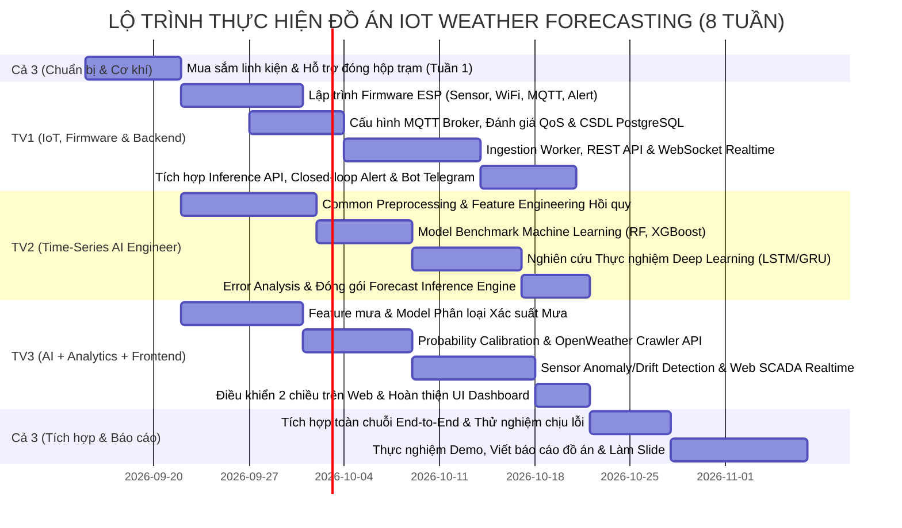

# KẾ HOẠCH PHÂN CHIA NHIỆM VỤ DỰ ÁN (TASK.MD)
## IoT Local Weather Monitoring & Short-Term Forecasting System

> **Quy mô dự án:** Nhóm 3 thành viên (Sinh viên năm 4 - Đồ án IoT)  
> **Nguyên tắc phân bổ tối ưu:**  
> - **TV1 (IoT + Backend Engineer):** Trực tiếp phụ trách toàn bộ chuỗi kết nối phần cứng - đám mây (ESP8266/ESP32, Cảm biến, Firmware nhúng, MQTT Broker, PostgreSQL Time-series, REST API, WebSocket và Vòng lặp điều khiển cảnh báo 2 chiều Closed-loop).  
> - **TV2 (Time-Series AI Engineer):** Phụ trách nền tảng xử lý dữ liệu chuỗi thời gian chung, Mô hình hồi quy nhiệt độ (Model 1), Đối chuẩn mô hình (Model Benchmark), Thực nghiệm Deep Learning (LSTM/GRU), Phân tích sai số (Error Analysis) & Đóng gói Forecast Inference.  
> - **TV3 (AI + Analytics + Frontend Engineer):** Phụ trách Mô hình phân loại xác suất mưa (Model 2), Hiệu chuẩn xác suất (Probability Calibration), Thuật toán phát hiện lỗi/trôi cảm biến (Sensor Anomaly/Drift), Đối chuẩn trạm khí tượng mở (OpenWeather Benchmark) & Giao diện Web Dashboard SCADA.  
> - **Cả 3 thành viên:** Hỗ trợ lắp ráp cơ khí phần cứng tuần đầu, phối hợp kiểm thử toàn hệ thống End-to-End, thực hiện kịch bản demo và viết báo cáo đồ án.

---

## 1. Bảng phân bổ vai trò chính (Core Responsibility Matrix)

| Thành viên | Vai trò chính | Trách nhiệm cốt lõi (Core Responsibility) | Đầu ra chính (Key Deliverables) |
|---|---|---|---|
| **Thành viên 1 (TV1)** | **IoT + Backend Engineer** | ESP8266/ESP32, BME280, Rain Sensor, Firmware C++, MQTT Broker (QoS), PostgreSQL/TimescaleDB, FastAPI, WebSocket Live, Closed-loop Alert & Telegram Bot. | Trạm đo IoT ổn định, Hệ thống Backend Ingestion, CSDL Time-series, REST/WebSocket API, Cơ chế điều khiển phản hồi 2 chiều. |
| **Thành viên 2 (TV2)** | **Time-Series AI Engineer** | Common Time-Series Preprocessing, Feature Engineering hồi quy, Temperature Forecasting (Model 1), Model Benchmark (ML), Deep Learning (LSTM/GRU), Error Analysis, Forecast Inference Engine. | Clean Data Pipeline, Mô hình dự báo nhiệt độ (+10m, +30m, +60m), Báo cáo đối sánh ML vs Deep Learning, Module Inference độc lập. |
| **Thành viên 3 (TV3)** | **AI + Analytics + Frontend Engineer** | Rain Probability Forecasting (Model 2), Probability Calibration, Sensor Anomaly & Drift Detection, OpenWeather Benchmark, Web Dashboard SCADA 2 chiều. | Mô hình xác suất mưa đã hiệu chuẩn, Thuật toán cảnh báo lỗi cảm biến, Báo cáo đối chuẩn sai số khí tượng, Giao diện Web SCADA realtime. |
| **Cả 3 thành viên** | **System Integration & Testing** | Lắp ráp hộp trạm bảo vệ, Tích hợp liên thông End-to-End, Kiểm thử chịu lỗi (Fault tolerance), Thực nghiệm 3 kịch bản Demo, Viết báo cáo & Slide thuyết trình. | Trạm đo ngoài trời hoàn chỉnh, Hệ thống tích hợp toàn chuỗi, Báo cáo Đồ án tốt nghiệp và Video Demo. |

---

## 2. Cây phân công nhiệm vụ chuyên môn (Work Breakdown Tree)

```text
DỰ ÁN: IOT LOCAL WEATHER FORECASTING
│
├── [THÀNH VIÊN 1] MODULE 1 & 2: IoT Hardware, Firmware & Backend Infrastructure
│   ├── Khảo sát, kiểm tra linh kiện (ESP8266/ESP32, BME280, Rain Sensor, OLED, Buzzer, LED)
│   ├── Thiết kế sơ đồ nguyên lý mạch & lập trình Firmware C++ đọc cảm biến (lọc nhiễu moving average)
│   ├── Lập trình WiFi & MQTT Client (Auto-reconnect, Publish payload JSON chu kỳ 5–10s)
│   ├── Lập trình Firmware nhận lệnh cảnh báo 2 chiều (bật còi Buzzer, nháy LED, hiển thị OLED)
│   ├── Cấu hình MQTT Broker (Mosquitto/EMQX) & Khảo sát thực nghiệm QoS (QoS 0 vs QoS 1)
│   ├── Thiết kế CSDL chuỗi thời gian PostgreSQL / TimescaleDB (Composite Index, Partitioning)
│   ├── Data Ingestion Worker (Python daemon nhận stream MQTT lưu trữ vào DB)
│   ├── Hệ thống REST API (FastAPI) & Kênh WebSocket Live đẩy dữ liệu tức thời
│   ├── Tích hợp API `/forecast` gọi Forecast Inference Engine từ TV2 & TV3
│   └── Closed-loop Actuation (tự động bắn alert xuống trạm IoT) & Tích hợp Bot Telegram
│
├── [THÀNH VIÊN 2] MODULE 3: Nền tảng Chuỗi thời gian, Dự báo Nhiệt độ & Nghiên cứu AI
│   ├── Common Time-Series Preprocessing (Xử lý missing data, resampling, loại bỏ ngoại lai, ADF test)
│   ├── Feature Engineering hồi quy (Lags $t-1, t-2, t-3, t-6$, chênh lệch $\Delta T$, rolling stats, cyclic time)
│   ├── Temperature Forecast (Model 1 - Hồi quy đa bước tại các mốc +10m, +30m, +60m)
│   ├── Model Benchmark (So sánh định lượng Baseline, Linear Regression, Random Forest, XGBoost)
│   ├── LSTM / GRU Experimentation (Huấn luyện mạng nơ-ron Deep Learning chuỗi thời gian trên sliding window)
│   ├── Error Analysis & Diagnostics (Phân tích phần dư, phân phối sai số MAE/RMSE/R² theo từng mốc thời gian)
│   └── Forecast Inference Engine (Đóng gói inference tổng hợp cho cả 2 model chuẩn hóa bàn giao cho TV1)
│
├── [THÀNH VIÊN 3] MODULE 4: Dự báo Xác suất Mưa, Phân tích Cảm biến & Web Dashboard
│   ├── Rain Probability (Model 2 - Xử lý dữ liệu mất cân bằng, đặc trưng tụt áp $\Delta P$, tăng ẩm $\Delta H$, phân loại mưa)
│   ├── Probability Calibration (Hiệu chuẩn xác suất bằng Platt Scaling/Isotonic, Brier Score, Calibration Curves)
│   ├── Sensor Anomaly & Drift Detection (Thuật toán phát hiện spike phi lý, frozen value khi cảm biến mưa đọng nước)
│   ├── OpenWeather Benchmark (Thu thập dữ liệu API OpenWeatherMap, phân tích sai số đối chuẩn cảm biến IoT)
│   ├── Web Dashboard SCADA (Giao diện realtime, biểu đồ đối sánh song song IoT vs OpenWeatherMap, hiển thị dự báo)
│   └── Điều khiển 2 chiều trên Web (Nhận WebSocket từ TV1, form tùy chỉnh ngưỡng cảnh báo gửi xuống server)
│
└── [CẢ 3 THÀNH VIÊN] MODULE 5: Tích hợp hệ thống, Kiểm thử Chịu lỗi & Báo cáo Đồ án
    ├── Hỗ trợ lắp ráp cơ khí hộp trạm bảo vệ ngoài trời (Tuần 1)
    ├── Ghép nối toàn chuỗi liên thông End-to-End
    ├── Kiểm thử kịch bản ngoại lệ & Fault tolerance (mất mạng, lỗi cảm biến, nghẽn tải)
    ├── Thực nghiệm đánh giá 3 kịch bản Demo
    ├── Biên soạn Báo cáo Đồ án kỹ thuật theo phân công
    └── Thiết kế Slide báo cáo & Quay video clip demo sản phẩm
```

---

## 3. Chi tiết công việc theo từng Module

### Module 1 & 2: IoT Hardware, Firmware & Backend Infrastructure
> **Phụ trách chính:** 👤 **Thành viên 1 (IoT + Backend Engineer)**  
> **Phối hợp:** TV2 và TV3 hỗ trợ lắp ráp cơ khí hộp trạm và mua linh kiện ở Tuần 1.  
> **Mục tiêu:** Xây dựng toàn bộ hạ tầng từ phần cứng thu thập đến máy chủ lưu trữ, cung cấp API và điều khiển phản hồi 2 chiều.

| Mã Task | Tên công việc | Mô tả chi tiết | Đầu ra (Deliverables) | Mức độ ưu tiên | Trạng thái |
|---|---|---|---|:---:|:---:|
| `IOT-01` | Khảo sát & Test linh kiện | Lựa chọn và kiểm tra thông số: ESP8266/ESP32, BME280 (I2C), Rain Sensor (Analog/Digital), Màn hình OLED SSD1306, Còi Buzzer, Đèn LED, module nguồn ổn áp. | Bảng test linh kiện hoạt động tốt | Cao | [ ] |
| `IOT-02` | Thiết kế mạch & Lắp ráp trạm | Thiết kế sơ đồ nguyên lý mạch (Schematic); hàn cắm test board; lắp ráp trạm đo vào hộp bảo vệ ngoài trời (chống nắng mưa, thông thoáng cho cảm biến). | Sơ đồ nguyên lý + Hộp trạm hoàn chỉnh | Cao | [ ] |
| `IOT-03` | Lập trình Firmware đọc cảm biến | Code C++/Arduino đọc BME280 và Rain Sensor; áp dụng bộ lọc trung bình trượt (Moving Average Filter) trên MCU để giảm nhiễu trước khi truyền đi. | Firmware đọc sensor chuẩn xác | Cao | [ ] |
| `IOT-04` | Lập trình WiFi & MQTT Client | Xây dựng cơ chế Auto-reconnect khi rớt mạng WiFi/MQTT; đóng gói payload JSON chuẩn; publish định kỳ 5–10s lên topic `weather/station01/data`. | Firmware MQTT Client hoạt động ổn định | Cao | [ ] |
| `IOT-05` | Firmware Điều khiển phản hồi | Lập trình subscribe topic `weather/station01/alert`; hiển thị số liệu lên OLED; kích hoạt còi Buzzer (tiếng ngắt quãng) và nhấp nháy LED khi nhận cảnh báo mưa cao. | Firmware phản hồi ngoại vi 2 chiều | Cao | [ ] |
| `BE-01` | Cài đặt MQTT Broker & Đo đạc QoS | Cấu hình Mosquitto/EMQX; thiết lập User/Password, bảo mật Topic; thực nghiệm khảo sát độ trễ và tỉ lệ mất gói tin ở hai mức QoS 0 và QoS 1. | Broker bảo mật + Báo cáo so sánh QoS | Cao | [ ] |
| `BE-02` | Thiết kế CSDL Time-Series | Thiết kế Schema PostgreSQL: bảng `weather_measurements`, đánh chỉ mục Composite Index (`device_id`, `timestamp DESC`), tối ưu hóa truy vấn cửa sổ trượt. | File SQL Migration & Schema tối ưu | Cao | [ ] |
| `BE-03` | Xây dựng Data Ingestion Worker | Viết service chạy ngầm (Python daemon) lắng nghe MQTT, validate dữ liệu, gán timestamp chuẩn ISO-8601 và ghi vào PostgreSQL với hiệu năng cao. | Worker chạy nền có logging và auto-recover | Cao | [ ] |
| `BE-04` | Xây dựng REST API & WebSocket | Phát triển API bằng FastAPI: `/current`, `/history` (phân trang, filter thời gian); kênh WebSocket `/ws/weather/live` đẩy dữ liệu realtime xuống dashboard. | Swagger UI Docs + Kênh WebSocket | Cao | [ ] |
| `BE-05` | Tích hợp Inference Engine API | Viết endpoint `GET /api/weather/forecast`: Lấy cửa sổ dữ liệu gần nhất từ DB, gọi hàm inference chuẩn hóa từ TV2 & TV3, trả về kết quả dự báo (+10, +30, +60m). | API dự báo tích hợp hoàn chỉnh | Cao | [ ] |
| `BE-06` | Closed-loop Control & Bot Telegram | Xây dựng Alert Engine: Khi xác suất mưa dự báo $\ge 70\%$ (hoặc ngưỡng tùy chỉnh), Backend tự động:<br>1. Publish lệnh cảnh báo xuống topic `weather/station01/alert` để trạm hú còi/bật LED.<br>2. Gửi tin nhắn cảnh báo tức thì qua Telegram Bot tới người dùng. | Hệ thống cảnh báo khép kín 2 chiều + Bot Telegram | Cao | [ ] |

---

### Module 3: Nền tảng Chuỗi thời gian, Dự báo Nhiệt độ & Nghiên cứu AI
> **Phụ trách chính:** 👤 **Thành viên 2 (Time-Series AI Engineer)**  
> **Phối hợp:** TV1 (kết nối DB lấy dữ liệu), TV3 (thống nhất format đầu ra inference).  
> **Mục tiêu:** Xây dựng pipeline tiền xử lý chuỗi thời gian chuẩn cho cả nhóm, mô hình hồi quy nhiệt độ đa bước, đối chuẩn Machine Learning vs Deep Learning, phân tích sai số và đóng gói inference engine.

| Mã Task | Tên công việc | Mô tả chi tiết | Đầu ra (Deliverables) | Mức độ ưu tiên | Trạng thái |
|---|---|---|---|:---:|:---:|
| `ML-01` | Common Time-Series Preprocessing | Xây dựng module tiền xử lý dữ liệu chuỗi thời gian dùng chung: xử lý missing values (nội suy spline/linear), khử ngoại lai (outliers), resampling đồng bộ chu kỳ đo; kiểm định tính dừng (ADF test) và tự tương quan (ACF/PACF). | Module preprocessing chuẩn dùng chung | Cao | [ ] |
| `ML-02` | Feature Engineering Hồi quy | Trích xuất đặc trưng chuỗi thời gian cho nhiệt độ: Lag features ($t-1, t-2, t-3, t-6$), chênh lệch $\Delta T$, thống kê trượt (Rolling mean, std trong 30m, 60m), mã hóa chu kỳ ngày/đêm (Sine/Cosine encoding). | Pipeline trích xuất đặc trưng nhiệt độ | Cao | [ ] |
| `ML-03` | Temperature Forecasting & Benchmark | Xây dựng Persistence Baseline ($T_{t+k} = T_t$); huấn luyện và so sánh các thuật toán ML: Linear Regression (Ridge/Lasso), Random Forest Regressor, XGBoost Regressor cho các mốc +10m, +30m, +60m; đánh giá MAE, RMSE, $R^2$. | Bảng thực nghiệm Model Benchmark | Cao | [ ] |
| `ML-04` | Thực nghiệm Deep Learning (LSTM/GRU) | Xây dựng mạng nơ-ron hồi quy chuỗi thời gian (LSTM hoặc GRU) bằng PyTorch/TensorFlow; huấn luyện trên cửa sổ trượt (Sliding window); so sánh thực nghiệm hiệu năng và chi phí tính toán giữa Deep Learning và XGBoost. | Code Deep Learning + Đồ thị so sánh Loss/MAE | Cao | [ ] |
| `ML-05` | Error Analysis & Diagnostics | Phân tích phần dư sai số (Residual Analysis); đánh giá mức độ suy giảm độ chính xác khi chân trời dự báo tăng dần (+10m $\rightarrow$ +30m $\rightarrow$ +60m); phân tích sai số trong điều kiện nhiệt độ biến đổi nhanh. | Báo cáo phân tích sai số & Đồ thị phân phối lỗi | Cao | [ ] |
| `ML-06` | Forecast Inference Engine | Lựa chọn model tối ưu; đóng gói pipeline tiền xử lý + weights (.joblib/ONNX); viết hàm chuẩn `predict_forecast(recent_data)` kết hợp kết quả dự báo nhiệt độ của TV2 và xác suất mưa của TV3 để TV1 nhúng vào API. | Module inference độc lập, dễ dàng import | Cao | [ ] |

---

### Module 4: Dự báo Xác suất Mưa, Phân tích Cảm biến & Web Dashboard
> **Phụ trách chính:** 👤 **Thành viên 3 (AI + Analytics + Frontend Engineer)**  
> **Phối hợp:** TV1 (kết nối WebSocket và API), TV2 (nhúng model vào inference).  
> **Mục tiêu:** Xây dựng mô hình phân loại dự báo xác suất mưa có hiệu chuẩn, thuật toán phát hiện bất thường/trôi cảm biến, đối chuẩn trạm khí tượng mở và phát triển Dashboard SCADA.

| Mã Task | Tên công việc | Mô tả chi tiết | Đầu ra (Deliverables) | Mức độ ưu tiên | Trạng thái |
|---|---|---|---|:---:|:---:|
| `SA-01` | Rain Probability Forecasting (Model 2) | Xử lý bài toán mất cân bằng dữ liệu (Imbalanced dataset); tạo các đặc trưng khí quyển đặc thù cho mưa: tốc độ tụt áp suất khí quyển ($\Delta P/\Delta t$), tốc độ tăng độ ẩm ($\Delta H/\Delta t$), trạng thái cảm biến mưa; huấn luyện mô hình phân loại (RF / XGBoost Classifier). | Pipeline đặc trưng mưa + Model phân loại | Cao | [ ] |
| `SA-02` | Probability Calibration & Curves | Căn chỉnh xác suất đầu ra bằng kỹ thuật **Platt Scaling** hoặc **Isotonic Regression** để xác suất $P \in [0, 1]$ phản ánh chính xác tần suất xuất hiện mưa thực tế; vẽ đường cong hiệu chuẩn (Calibration Curves); đánh giá qua Brier Score, ROC-AUC, PR-AUC. | Model mưa đã hiệu chuẩn + Đồ thị Calibration | Cao | [ ] |
| `SA-03` | Sensor Anomaly & Drift Detection | Phát triển thuật toán phát hiện lỗi dữ liệu phần cứng IoT:<br>- Phát hiện đột biến dị thường (Spike/Out-of-range).<br>- Phát hiện giá trị bị kẹt (Frozen value / Sensor drift do cảm biến mưa đọng nước lâu ngày hoặc BME280 bị lỗi). | Module thuật toán Anomaly Detector | Cao | [ ] |
| `SA-04` | OpenWeather Benchmark & Bias Analysis | Viết script crawler định kỳ thu thập dữ liệu thời tiết tại cùng tọa độ từ OpenWeatherMap / Open-Meteo API; phân tích đối chuẩn sai số (Bias/Error Analysis) giữa cảm biến IoT giá rẻ của nhóm và trạm khí tượng chuẩn. | Báo cáo đối sánh chất lượng cảm biến + Dataset benchmark | Cao | [ ] |
| `SA-05` | Web Dashboard SCADA | Phát triển giao diện Web Dashboard theo dõi thời gian thực (HTML5/CSS3/JS hoặc Vue/React + Tailwind):<br>- Thẻ chỉ số hiện tại (Nhiệt độ, Độ ẩm, Khí áp, Mưa).<br>- Biểu đồ chuỗi thời gian tương tác (Chart.js / ApexCharts) vẽ đồng thời dữ liệu trạm IoT và dữ liệu OpenWeatherMap.<br>- Khung hiển thị dự báo (+10m, +30m, +60m) kèm thanh đo xác suất mưa.<br>- Cảnh báo lỗi cảm biến từ task SA-03. | Giao diện Dashboard SCADA hoàn chỉnh, responsive | Cao | [ ] |
| `SA-06` | Điều khiển 2 chiều & WebSocket | Kết nối kênh WebSocket từ Backend TV1 để cập nhật dữ liệu mượt mà không độ trễ; thiết kế form trên Dashboard cho phép người dùng tùy chỉnh ngưỡng cảnh báo mưa (ví dụ: đổi từ 70% sang 60%) gửi ngược về Backend. | Dashboard tương tác 2 chiều thời gian thực | Trung bình | [ ] |

---

### Module 5: Tích hợp hệ thống, Kiểm thử Toàn diện & Báo cáo Đồ án
> **Phụ trách:** 👥 **Cả 3 thành viên làm chung**  
> **Mục tiêu:** Ghép nối liên hoàn toàn bộ chuỗi hệ thống, kiểm thử các kịch bản ngoại lệ, đánh giá hiệu năng tổng thể và hoàn thiện hồ sơ bảo vệ đồ án.

| Mã Task | Tên công việc | Phân công cụ thể | Đầu ra (Deliverables) | Mức độ ưu tiên | Trạng thái |
|---|---|---|---|:---:|:---:|
| `SYS-01` | Tích hợp liên thông Toàn chuỗi (End-to-End) | Cả 3 cùng ghép nối:<br>Cảm biến $\rightarrow$ ESP $\rightarrow$ MQTT Broker $\rightarrow$ Ingestion Worker $\rightarrow$ PostgreSQL $\rightarrow$ AI Inference Engine (Nhiệt độ TV2 + Mưa TV3) $\rightarrow$ Dashboard $\rightarrow$ Closed-loop Trigger $\rightarrow$ ESP Còi/Đèn & Bot Telegram. | Hệ thống hoạt động liên thông hoàn chỉnh | Cao | [ ] |
| `SYS-02` | Kiểm thử Chịu lỗi & Kịch bản Ngoại lệ | - Mất WiFi / Mất kết nối MQTT Broker và khả năng tự phục hồi (TV1)<br>- Cảm biến bị rút nguồn / kẹt nước lâu ngày (TV3 + TV1)<br>- Dữ liệu bị gián đoạn chuỗi thời gian (TV2)<br>- Nghẽn API hoặc mất kết nối WebSocket (TV1 + TV3). | Bảng kết quả Stress test & Fault tolerance | Cao | [ ] |
| `SYS-03` | Thực nghiệm Đánh giá 3 Kịch bản Demo | - Kịch bản 1: Giám sát ổn định liên tục, hiển thị biểu đồ realtime.<br>- Kịch bản 2: Dự báo thời tiết ngắn hạn và so sánh với giá trị thực tế sau 10/30/60 phút.<br>- Kịch bản 3: Kích hoạt tình huống mưa mô phỏng $\rightarrow$ Hệ thống dự báo xác suất cao $\rightarrow$ Phát cảnh báo 2 chiều (Web đổi màu, Bot gửi tin, ESP hú còi). | Biên bản nghiệm thu và số liệu đo đạc demo | Cao | [ ] |
| `SYS-04` | Biên soạn Báo cáo Đồ án Kỹ thuật | - TV1: Viết chương Phần cứng IoT, Firmware, Giao thức truyền thông, Kiến trúc CSDL & Điều khiển phản hồi.<br>- TV2: Viết chương Nền tảng Time Series, Mô hình Hồi quy Nhiệt độ, Thực nghiệm Deep Learning & Phân tích sai số.<br>- TV3: Viết chương Mô hình Dự báo Mưa & Calibration, Thuật toán Anomaly Detection, Đối chuẩn OpenWeatherMap & Dashboard SCADA.<br>- Cả 3: Viết chương Mở đầu, Kết quả thực nghiệm toàn hệ thống & Kết luận. | File Báo cáo Đồ án hoàn chỉnh (.docx / .pdf) | Cao | [ ] |
| `SYS-05` | Biên tập Slide Thuyết trình & Video Demo | Cùng xây dựng Slide báo cáo chuyên nghiệp; quay video clip chất lượng cao ghi lại toàn bộ hoạt động của trạm đo ngoài trời, quá trình gửi dữ liệu, giao diện web và cảnh báo phản hồi. | Bộ Slide báo cáo + Video Clip Demo sản phẩm | Cao | [ ] |

---

## 4. Lộ trình thực hiện chi tiết theo Tuần (Project Timeline)



---

## 5. Ma trận phân công trách nhiệm (RACI Matrix)

* **R (Responsible):** Người trực tiếp triển khai chính.
* **A (Accountable):** Người chịu trách nhiệm cao nhất về chất lượng đầu ra.
* **C (Consulted):** Người được trao đổi, phối hợp kỹ thuật.
* **I (Informed):** Người được thông báo kết quả.

| Hạng mục công việc kỹ thuật | TV1 (IoT + Backend) | TV2 (Time-Series AI) | TV3 (AI + Analytics + FE) |
|---|:---:|:---:|:---:|
| **Khảo sát linh kiện & Đóng hộp trạm đo** | **R / A** | R | R |
| **Thiết kế mạch & Firmware C++ ESP** | **R / A** | I | I |
| **Cấu hình MQTT Broker & Đánh giá QoS** | **R / A** | I | C |
| **Kiến trúc Time-Series DB & Ingestion Worker** | **R / A** | C | C |
| **REST API, WebSocket & Điều khiển 2 chiều** | **R / A** | C | C |
| **Bot Telegram Cảnh báo Tự động** | **R / A** | I | I |
| **Common Time-Series Preprocessing & EDA** | C | **R / A** | C |
| **Temperature Forecast (Model 1 - Hồi quy đa bước)** | I | **R / A** | I |
| **Model Benchmark (Linear, RF, XGBoost)** | I | **R / A** | I |
| **LSTM / GRU Deep Learning Experimentation** | I | **R / A** | I |
| **Error Analysis & Residual Diagnostics** | I | **R / A** | C |
| **Unified Forecast Inference Engine** | C | **R / A** | C |
| **Rain Probability (Model 2 - Phân loại mưa)** | I | C | **R / A** |
| **Probability Calibration & Curves** | I | C | **R / A** |
| **Sensor Anomaly & Drift Detection** | C | I | **R / A** |
| **OpenWeather Benchmark & Bias Analysis** | I | C | **R / A** |
| **Web Dashboard SCADA & Giám sát 2 chiều** | C | C | **R / A** |
| **Tích hợp Liên thông Toàn chuỗi End-to-End** | **R / A** | **R / A** | **R / A** |
| **Kiểm thử Kịch bản Ngoại lệ & Stress Testing** | **R** | **R** | **R** |
| **Biên soạn Báo cáo Đồ án & Slide Thuyết trình** | **R** | **R** | **R** |

---

## 6. Tiêu chí hoàn thành (Definition of Done - DoD)

Một nhiệm vụ kỹ thuật được xem là `[x] Hoàn thành` khi đạt tất cả các yêu cầu sau:
1. **Yêu cầu Kỹ thuật & Học thuật:** Đạt đầy đủ các chỉ số định lượng đề ra (Ví dụ: Model nhiệt độ có MAE tốt hơn Baseline; Model mưa có đường cong Calibration hợp lý; Worker không làm rơi gói tin MQTT).
2. **Kiểm thử Độc lập & Liên thông:** Module đã được viết script test chức năng và vượt qua bài test ghép nối với các module liên quan.
3. **Quản lý Mã nguồn (Git):** Mã nguồn được commit lên branch tương ứng, có comment giải thích thuật toán rõ ràng và tuân thủ coding convention của nhóm.
4. **Tài liệu & Báo cáo:** Có tài liệu ngắn (Markdown hoặc docstring) giải thích cách vận hành, kèm kết quả thực nghiệm để đưa trực tiếp vào Báo cáo Đồ án tốt nghiệp/môn học.
