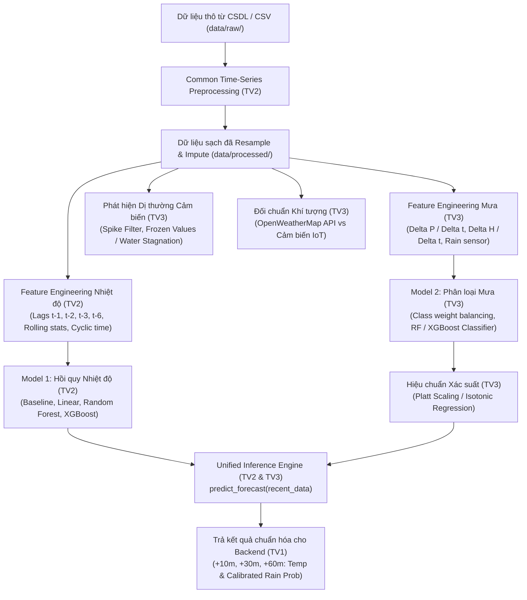

# MODULE 3 & 4: TIME-SERIES AI ENGINE & WEATHER ANALYTICS
## Nền Tảng Phân Tích Chuỗi Thời Gian, Dự Báo Nhiệt Độ, Xác Suất Mưa & Phát Hiện Dị Thường Cảm Biến

> **Phụ trách chính:**  
> - 👤 **Thành viên 2 (Time-Series AI Engineer):** Module Preprocessing dùng chung, Feature Engineering Nhiệt độ, Model 1 (Hồi quy nhiệt độ +10, +30, +60m), Deep Learning (LSTM/GRU), Phân tích sai số & Đóng gói Unified Inference Engine. (`ML-01` $\rightarrow$ `ML-06`).  
> - 👤 **Thành viên 3 (AI + Analytics Engineer):** Model 2 (Phân loại mưa), Probability Calibration (Platt/Isotonic), Sensor Anomaly & Drift Detection, OpenWeather Benchmark. (`SA-01` $\rightarrow$ `SA-04`).  
> (Xem chi tiết phân công tại [TASK.md](../TASK.md)).

---

## 1. Kiến trúc Subsystem AI & Analytics



---

## 2. Cấu trúc Thư mục AI Engine

```text
ai_engine/
├── README.md                       # Tài liệu tổng thể cho TV2 & TV3
├── requirements.txt                # Thư viện AI (scikit-learn, xgboost, pandas, numpy...)
├── data/
│   ├── raw/                        # Dữ liệu đo thô thu thập từ trạm IoT (.gitignore)
│   ├── processed/                  # Dữ liệu sạch sau khi resample và khử nhiễu (.gitignore)
│   └── sample/
│       └── sample_weather_data.csv # Dữ liệu mẫu kiểm thử CI/CD (1440 dòng chu kỳ 1 phút)
├── common/                         # [TV2] Module chuỗi thời gian dùng chung
│   └── preprocessing.py            # Nội suy missing value, lọc outlier, ADF stationarity test
├── temperature_forecasting/        # [TV2] Dự báo nhiệt độ đa bước
│   ├── features.py                 # Lag features, rolling statistics, cyclic time sine/cosine
│   └── train_temperature.py        # Huấn luyện Baseline, RF, XGBoost; tính MAE, RMSE, R2
├── rain_classification/            # [TV3] Dự báo xác suất mưa
│   ├── features.py                 # Tốc độ tụt áp Delta P, tăng ẩm Delta H
│   └── train_rain.py               # Huấn luyện phân loại, Isotonic/Platt calibration, Brier score
├── sensor_analytics/               # [TV3] Phân tích dị thường cảm biến
│   └── anomaly_detector.py         # Phát hiện spike bất thường và kẹt giá trị (frozen value)
├── openweather_benchmark/          # [TV3] Đối chuẩn trạm khí tượng
│   └── crawler.py                  # Thu thập OpenWeatherMap API & tính toán sai số Bias
├── inference/                      # [TV2] Unified Forecast Inference Engine
│   └── unified_forecast.py         # Hàm predict_forecast() chuẩn hóa bàn giao cho Backend TV1
├── saved_models/                   # Weights đã lưu (.joblib)
└── notebooks/                      # [TV2 & TV3] Jupyter Notebooks vẽ biểu đồ báo cáo đồ án
```

---

## 3. Phân công Chi tiết & Giao diện Kết nối (Interface Contracts)

### 3.1. Trách nhiệm Thành viên 2 (Time-Series AI Engineer)
1. **Module Preprocessing dùng chung (`common/preprocessing.py`):**
   - Resample dữ liệu thời gian cố định (ví dụ: 1 phút hoặc 5 phút).
   - Xử lý giá trị thiếu (missing values) bằng nội suy tuyến tính hoặc Spline.
   - Khử ngoại lai (Outliers) bằng 3-Sigma hoặc IQR.
   - Kiểm định tính dừng chuỗi thời gian bằng Augmented Dickey-Fuller (ADF test).
2. **Dự báo Nhiệt độ (`temperature_forecasting/`):**
   - Xây dựng Persistence Baseline ($T_{t+k} = T_t$).
   - Huấn luyện XGBoost / Random Forest cho 3 mốc: $+10$ phút, $+30$ phút, $+60$ phút.
   - Đánh giá chỉ số: **MAE $\le 0.8^\circ$C**, **RMSE**, **$R^2 \ge 0.85$**.
3. **Đóng gói Inference Engine (`inference/unified_forecast.py`):**
   - Nhận `recent_data` (DataFrame 30 bản ghi gần nhất).
   - Tự động gọi mô hình nhiệt độ (TV2) và mô hình mưa (TV3).
   - Xuất dictionary chuẩn hóa cho TV1.

### 3.2. Trách nhiệm Thành viên 3 (AI Analytics Engineer)
1. **Dự báo Xác suất Mưa (`rain_classification/`):**
   - Trích xuất đặc trưng vật lý khí quyển: Tốc độ tụt áp ($\Delta P/\Delta t$), tốc độ tăng ẩm ($\Delta H/\Delta t$).
   - Xử lý mất cân bằng lớp (Imbalanced dataset) bằng `class_weight='balanced'`.
2. **Hiệu chuẩn Xác suất (Probability Calibration):**
   - Sử dụng **Isotonic Regression** hoặc **Platt Scaling** (`CalibratedClassifierCV`).
   - Đánh giá bằng **Brier Score** ($< 0.15$) và vẽ đường cong **Calibration Curve**.
3. **Phát hiện Bất thường Cảm biến (`sensor_analytics/`):**
   - Bắt các spike phi lý (Nhiệt độ $> 55^\circ$C hoặc Áp suất $< 900$ hPa).
   - Bắt lỗi kẹt nước (Frozen value): Cảm biến mưa báo ướt liên tục quá 6 tiếng khi độ ẩm môi trường đã giảm xuống dưới 65%.
4. **Đối chuẩn Khí tượng (`openweather_benchmark/`):**
   - Định kỳ lấy dữ liệu OpenWeatherMap tại cùng tọa độ trạm đo để phân tích Mean Bias Error (MBE).

---

## 4. Chuẩn Giao diện Đầu ra của Inference Engine (Unified Contract)

Hàm `predict_forecast(recent_data)` trong `inference/unified_forecast.py` bắt buộc trả về định dạng sau để Backend TV1 không bị lỗi:

```json
{
  "device_id": "station01",
  "generated_at": "2026-09-12T10:30:00Z",
  "current_temperature": 31.2,
  "current_humidity": 78.5,
  "current_pressure": 1005.8,
  "plus_10m": {
    "temperature_c": 31.0,
    "rain_probability": 0.25,
    "rain_level": "Low"
  },
  "plus_30m": {
    "temperature_c": 30.4,
    "rain_probability": 0.62,
    "rain_level": "Medium"
  },
  "plus_60m": {
    "temperature_c": 29.6,
    "rain_probability": 0.84,
    "rain_level": "High"
  },
  "alert_triggered": true,
  "alert_message": "Canh bao xac suat mua cao trong 60 phut toi!"
}
```

---

## 5. Hướng dẫn Cài đặt & Chạy Thực nghiệm

```bash
cd ai_engine
python -m venv .venv

# Kích hoạt venv (Windows: .venv\Scripts\activate | Linux: source .venv/bin/activate)
pip install -r requirements.txt

# 1. Chạy huấn luyện mô hình dự báo nhiệt độ (TV2)
python temperature_forecasting/train_temperature.py

# 2. Chạy huấn luyện và hiệu chuẩn mô hình xác suất mưa (TV3)
python rain_classification/train_rain.py

# 3. Chạy kiểm thử hàm suy luận hợp nhất (TV2 & TV3)
python inference/unified_forecast.py
```

---

## 6. Tiêu chí Hoàn thành (DoD)

- [ ] MAE của mô hình dự báo nhiệt độ tốt hơn Persistence Baseline ở cả 3 mốc (+10m, +30m, +60m).
- [ ] Mô hình dự báo mưa có đường cong Calibration Curve bám sát đường phân giác lý tưởng (Brier Score thấp).
- [ ] Module Anomaly Detector lọc thành công các spike nhân tạo mà không làm rơi mẫu hợp lệ.
- [ ] File `inference/unified_forecast.py` chạy độc lập thành công và trả về đúng JSON Schema.

