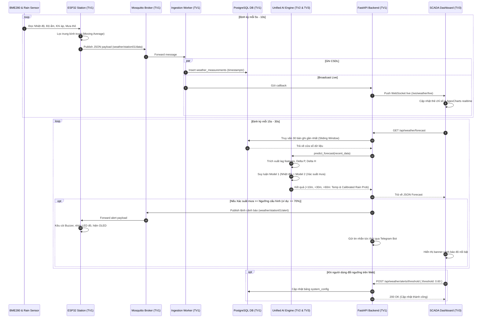
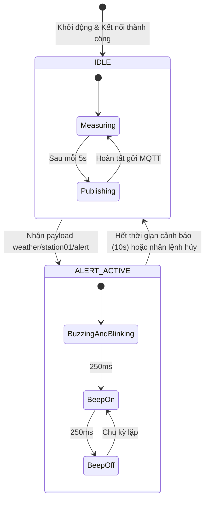

# KIẾN TRÚC HỆ THỐNG TOÀN DIỆN (SYSTEM ARCHITECTURE SPECIFICATION)
## IoT Local Weather Monitoring & Short-Term Forecasting System

---

## 1. Sơ đồ Luồng Dữ liệu Tuần tự (Sequence Diagram)

Sơ đồ dưới đây mô tả luồng dữ liệu 2 chiều khép kín từ lúc cảm biến đọc tín hiệu đến khi Dashboard hiển thị và kích hoạt cảnh báo:



---

## 2. Thiết kế Cấu trúc CSDL (Database Schema & Indexes)

```mermaid
erDiagram
    weather_measurements {
        bigserial id PK
        varchar(50) device_id
        timestamptz timestamp
        numeric(5,2) temperature
        numeric(5,2) humidity
        numeric(6,2) pressure
        integer rain_raw
        smallint rain_detected
        timestamptz created_at
    }

    alert_logs {
        bigserial id PK
        varchar(50) device_id
        timestamptz timestamp
        varchar(50) alert_type
        numeric(5,4) rain_probability
        numeric(5,4) threshold
        boolean mqtt_sent
        boolean telegram_sent
        text notes
    }

    system_config {
        varchar(100) config_key PK
        varchar(255) config_value
        timestamptz updated_at
    }

    weather_measurements ||--o{ alert_logs : "triggers"
```

- **Composite Index:** `CREATE INDEX idx_weather_device_timestamp ON weather_measurements (device_id, timestamp DESC);`
  - Đảm bảo các truy vấn lấy bản ghi mới nhất hoặc cửa sổ trượt 30 điểm gần nhất đạt độ trễ $< 5$ms.

---

## 3. Máy Trạng thái Phản hồi Cảnh báo trên ESP (Firmware State Machine)



